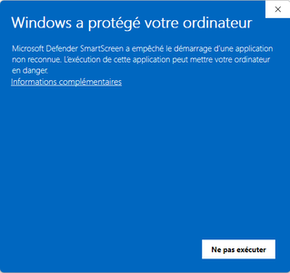
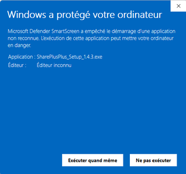
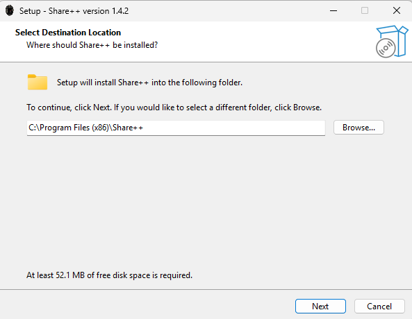
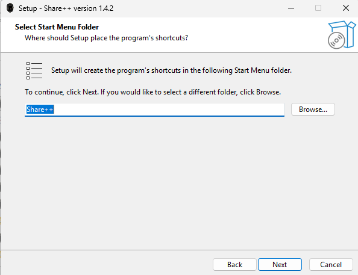
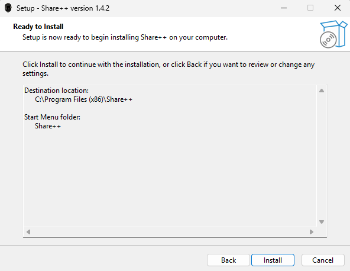
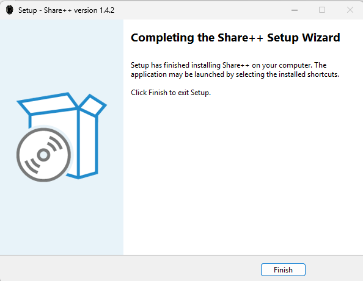

# Manuel d'installation Share++

## Prérequis

| Dépendence | Nécessite |
|---|---|
| Système d'exploitation | Windows 10 / 11 (64 bits) |
| Droits administrateur | Oui (demandés par l'assistant) |
| Connexion internet | Non (installation hors ligne possible) |
| Python & librairies | Non (inclus dans l'exécutable) |

---

## 1. Téléchargement de l'assistant d'installation de l'application graphique

1. Se rendre sur le dépôt GitHub du projet :  
   **https://github.com/NathanFilipowitz/Sharepp**

2. Cliquer sur l'onglet **Releases**.

3. Sous la section **Assets**, télécharger la dernière version de l'assistant d'installation Share++ **`SharePlusPlus_Setup_X.X.X.exe`**.

---

## 2. Lancement de l'assistant d'installation

1. Double-cliquer sur l'executable `SharePlusPlus_Setup_X.X.X.exe` téléchargé.

2. Un popup d'avertissement Windows apparaitra probablement, ceci est normal 

. 

Cliquer sur **Informations complémentaires** puis **Exécuter quand même**.



3. Si une fenêtre s'ouvre et demande les droits administrateur. Cliquer sur **Oui**.

4. L'assistant d'installation Inno Setup démarre.

> Le message d'avertissement apparaît car l'exécutable n'est pas certifié par une autorité commerciale payante.
---

## 3. Étapes de l'assistant

### Répertoire d'installation


Le répertoire par défaut est :
```
C:\Program Files (x86)\Share++
```
Vous pouvez modifier le répertoire d'installation ou continuer avec le répertoire proposé par défaut. Cliquer sur **Suivant**.

### Dossier du menu Démarrer



Un groupe **Share++** sera créé dans le menu Démarrer. Cliquer sur **Suivant**.

### Prêt à installer



Vérifier le résumé et cliquer sur **Installer**.

### Fin



Cliquer sur **Finish**. Share++ peut être utilisé sans redémarage.

---

## 4. Fichiers installés sur la machine

### Répertoire d'installation  `C:\Program Files (x86)\Share++\`

```
Share++\
├── sharepp.exe              > Exécutable principal de l'application
├── *.dll                    > Les autres fichiers sont des dépendences nécéssaires au bon fonctionnement de l'application
├── data\
├── DLLs\
├── Lib\
└── site-packages\
```

### Données utilisateur  `%APPDATA%\SharePlusPlus\`

Ce répertoire est créé automatiquement au **premier lancement** de l'application. Il contient :

```
SharePlusPlus\
├── settings.json            > Paramètres utilisateur
└── sharepp.log              > Journal persistant actions de l'application et des téléchargements rentrants
```

> Ce répertoire n'est **pas** supprimé lors de la désinstallation afin de conserver l'historique et les préférences. Pour une désinstallation complète, vous devez supprimer ce dossier manuellement après avoir désinstallé l'application.

### Raccourcis créés

| Emplacement | Nom |
|---|---|
| Bureau | Share++ |
| Menu Démarrer (Touche windows) | Share++ |

### Entrée de registre (menu contextuel)

L'installateur ajoute une entrée dans le registre Windows permettant de lancer Share++ directement depuis l'Explorateur de fichiers en faisant un clic droit sur un dossier :

```
HKEY_CURRENT_USER\Software\Classes\Directory\shell\SharePP
```

Cette donnée est **supprimée automatiquement** lors de la désinstallation.

---

## 5. Désinstallation

### Via les Paramètres Windows (recommandé)

1. Dans **Paramètres > Applications > Applications installées**.
2. Rechercher **Share++** dans la liste.
3. Cliquer sur les trois points `...` puis **Désinstaller**.

### Via le menu Démarrer

1. Ouvrir le menu Démarrer et rechercher **Share++**.
2. Clic droit sur l'application > **Désinstaller**.

---

### Est supprimé lors de la désinstallation

| Donnée | Supprimée |
|---|---|
| `C:\Program Files\Share++\` | ✔ Oui |
| Raccourcis (bureau et menu Démarrer) | ✔ Oui |
| Entrée du menu contextuel (registre) | ✔ Oui |
| `%APPDATA%\SharePlusPlus\` (préférences et logs) | ✘ Non |

---

## 6. Installation de la version CLI (optionnel)

La version en ligne de commande `sharepp-cli.exe` est un exécutable portable : elle **ne nécessite donc aucune installation**.

1. Télécharger `sharepp-cli.exe` depuis la même page **Releases** du dépôt GitHub.
2. Placer le fichier dans un répertoire ajouté au `PATH` afin d'utiliser l'outil depuis n'importe quel emplacement (optionnel)

Pour ajouter un répertoire au `PATH`:
1. Ouvrir le menu démarrer et entrer 'variables d'environnements'
2. Cliquer sur le bouton 'Variables d'environnement en bas de la fenêtre
3. Sélectionner la variable 'Path' pour l'utilisateur ou le système puis 'Modifier...'
4. Ajouter une entrée avec le chemin vers votre répertoire contenant sharepp-cli.exe
5. Cliquer sur 'OK' (2x)
6. sharepp-cli.exe est maintenant disponible sans avoir à vous situer au même niveau que l'executable

Consulter le **Manuel d'Utilisation** pour les détails de l'utilisation de l'application GUI et CLI.