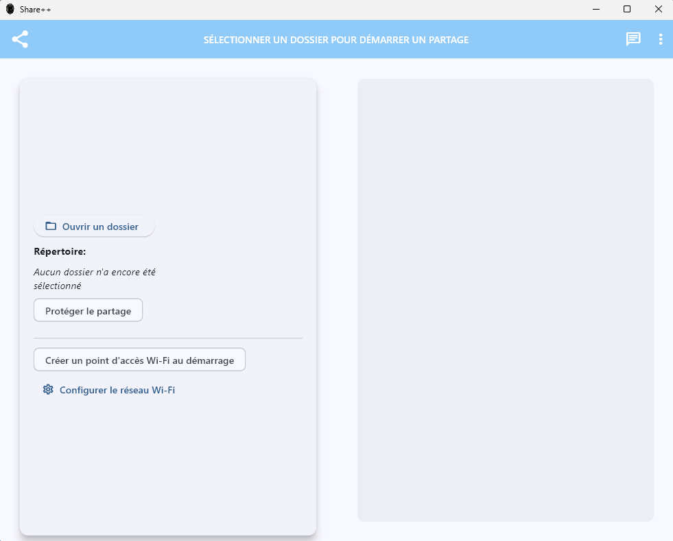
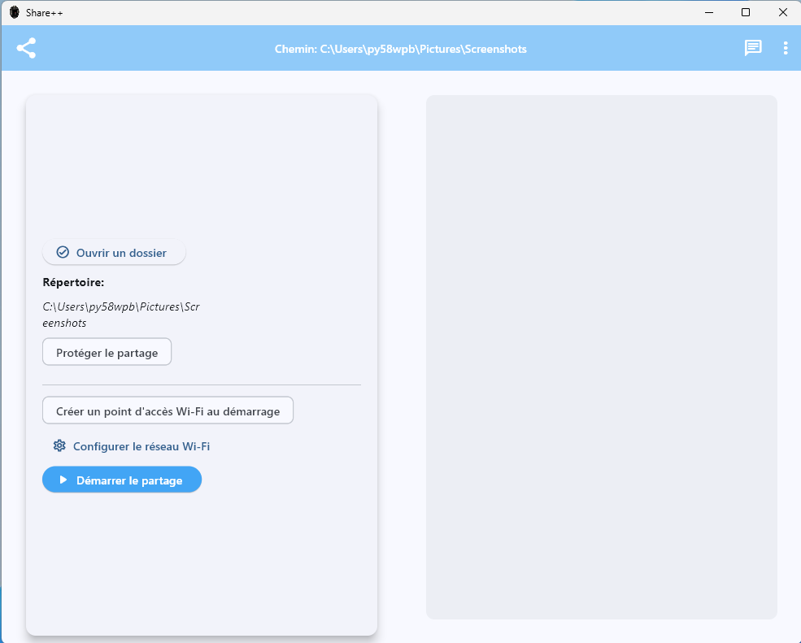
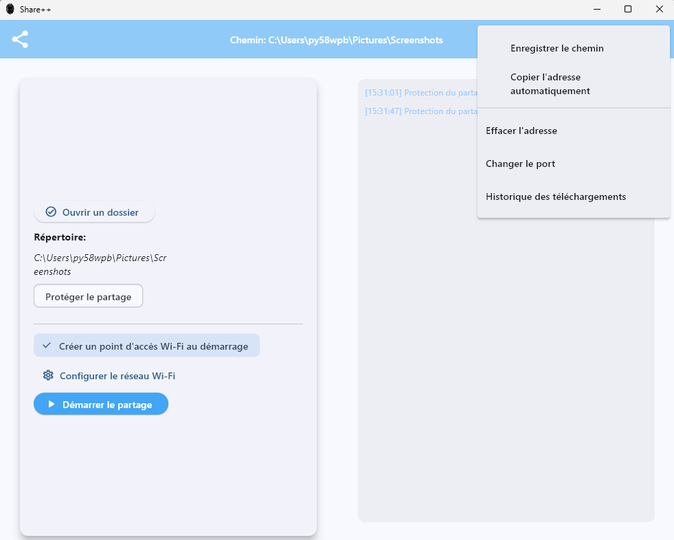
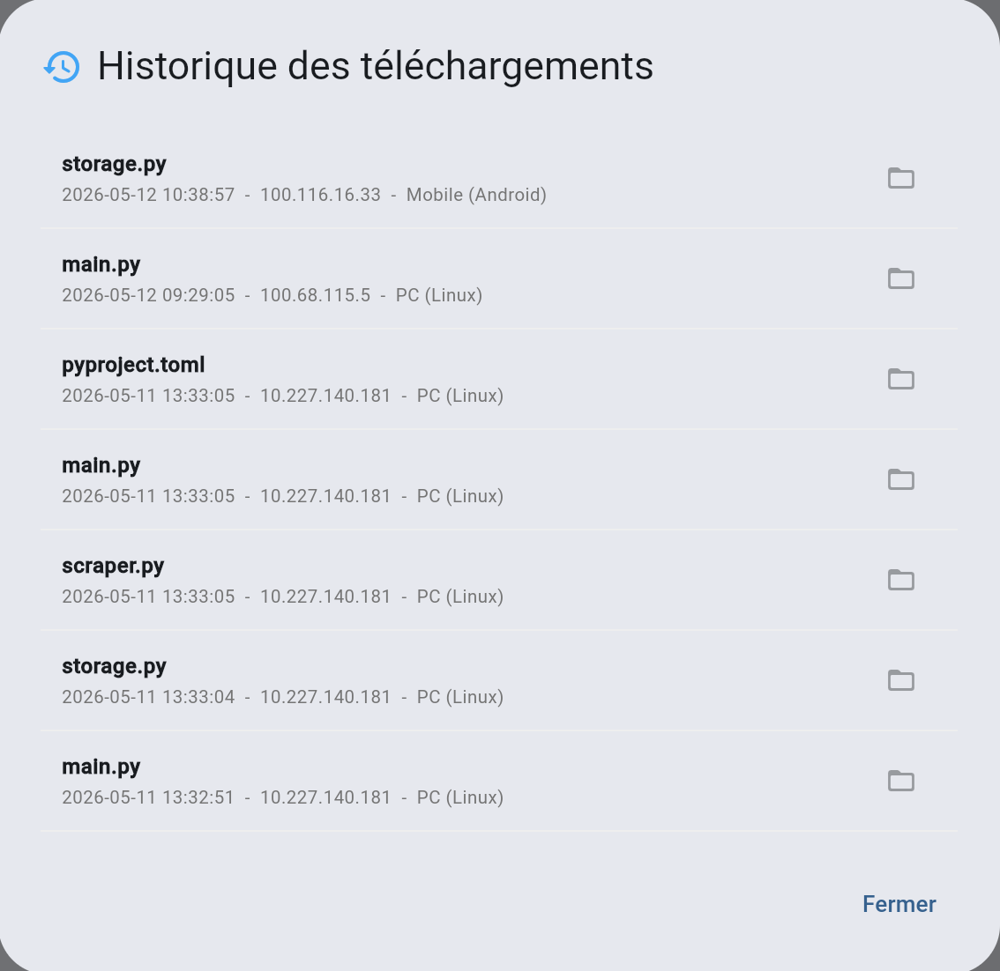
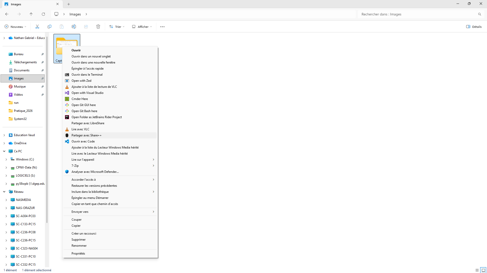
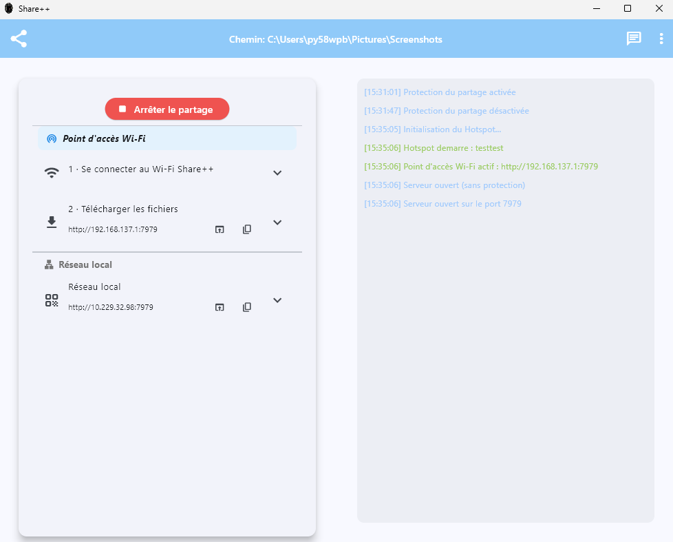
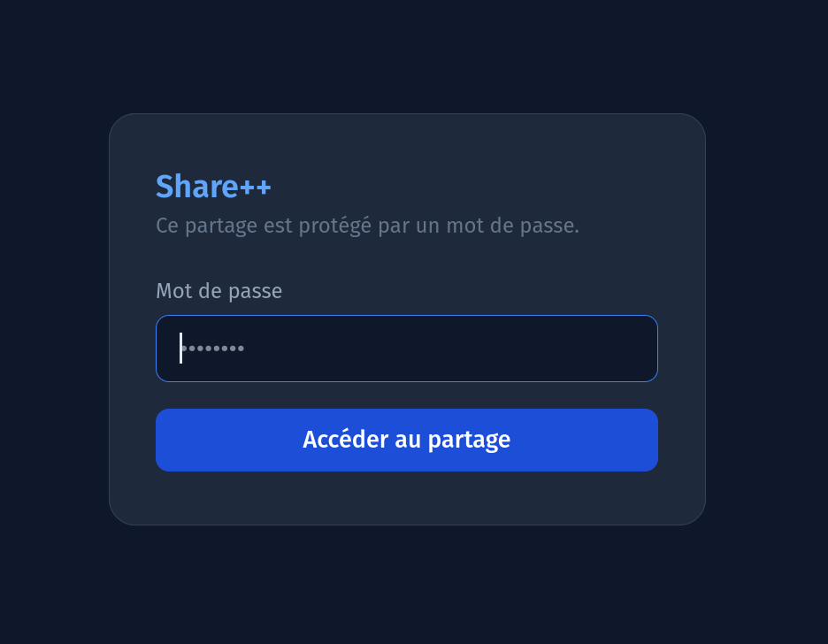
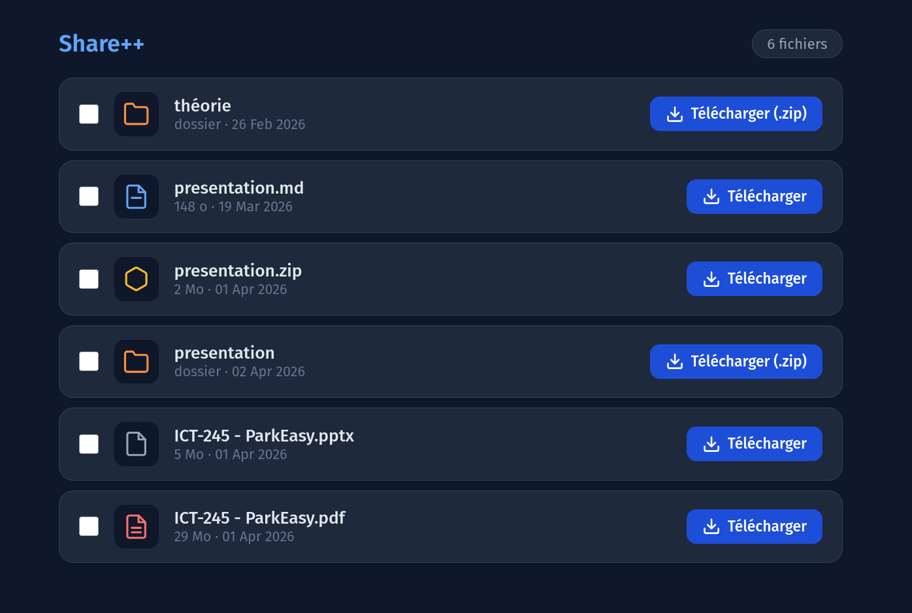

# Manuel d'utilisation Share++

## 1. Lancer l'application

Pour démarrer l'application, double-cliquer sur l'icône Share++ sur le bureau, ou depuis le menu Démarrer.

Il est possible de lancer l'application avec un chemin de fichier déjà configuré et le serveur de fichier ouvert via le menu contextuel (clic droit sur un répertoire > Partager avec Share++)

> Note pour les experts: Le lancement via le menu contextuel de l'explorateur de fichier Windows (clic droit sur un dossier > Partager avec Share++) a été introduit comme fonctionnalité lors du préTPI. La version packagée actuelle présente une **régression** sur ce point : actuellement une fenêtre vide s'ouvre et rien ne se passe. Le serveur ne démarre pas sur le dossier sélectionné. La cause probable du problème doit être au niveau de la transmission de l'argument de chemin à un executable autonome Flet packagé. La correction est identifiée comme travail futur (voir section 4.5 du dossier de projet).

---

## 2. Sélectionner un dossier à partager



**1.** Cliquer sur **"Ouvrir un dossier"** dans la carte de gauche.  
**2.** Sélectionner le répertoire à partager depuis l'explorateur de fichier Windows qui s'ouvre.  
**3.** Le bouton **"Démarrer le partage"** devient visible, le répertoire sélectionné s'affiche.

---

## 3. Démarrer le serveur de partage


**1.** Cliquer sur **"Démarrer le partage"**.  
**2.** Le serveur démarre sur le **port configuré**.  
**3.** Une ou plusieurs entrées de connexion apparaissent dans la carte :
   - **Réseau local** : accessible par tous les appareils présents sur le même réseau local.
   - **Tailscale** : visible uniquement si Tailscale est actif sur la machine (voir section 4.3).
   - **Point d'accès Wi-Fi** : visible si le hotspot a été activé (voir section 4.2).

**4.** Chaque entrée affiche l'URL cliquable, un bouton d'ouverture dans le navigateur et un bouton de copie dans le presse-papier.

> Cliquez sur l'icône `›` d'une entrée pour afficher le QR code correspondant. Il peut être scanné depuis un smartphone pour accéder directement à la page de téléchargement.

---

## 4. Fonctionnalités avancées

### 4.1 Protection par mot de passe



**1.** Cliquez sur le chip **« Protéger le partage »** avant de démarrer le serveur.  
**2.** Un champ mot de passe apparaît. Saisissez un mot de passe (8 caractères minimum recommandé).  
**3.** Démarrez le serveur normalement.  
**4.** Les appareils clients devront saisir ce mot de passe sur la page d'authentification avant d'accéder aux fichiers.

> Le mot de passe est stocké sous forme de hash SHA-256 dans `settings.json`. Il n'est jamais transmis en clair.

---

### 4.2 Point d'accès Wi-Fi (hotspot ad hoc)


> **Prérequis :** Windows uniquement. La carte Wi-Fi de la machine doit supporter le mode réseau hébergé (`netsh wlan show drivers` → *Réseau hébergé pris en charge : Oui*). Des droits administrateur sont requis.

**1.** Cliquez sur **« Configurer le réseau Wi-Fi »** pour définir le SSID et le mot de passe du réseau (8 caractères minimum, requis par WPA2).  
**2.** Cliquez sur le chip **« Créer un point d'accès Wi-Fi au démarrage »** pour activer la fonctionnalité.  
**3.** Démarrez le serveur. Share++ crée automatiquement le réseau Wi-Fi au lancement.  
**4.** Sur le smartphone : scannez le QR code **« 1 · Se connecter au Wi-Fi Share++ »** pour rejoindre le réseau, puis scannez **« 2 · Télécharger les fichiers »** pour accéder aux fichiers.

> Le réseau ad hoc est automatiquement arrêté à l'arrêt du serveur.

---

### 4.3 Partage à distance via Tailscale

> **Prérequis :** Tailscale doit être installé et actif sur la machine hôte. L'appareil client doit être membre du même Tailnet.

Aucune configuration n'est nécessaire dans Share++. Au démarrage du serveur, l'application détecte automatiquement l'adresse IP Tailscale (100.x.x.x) et affiche une tuile **« Tunnel (Tailscale) »** supplémentaire avec l'URL et le QR code correspondants.

> Si la tuile Tailscale n'apparaît pas, vérifiez que Tailscale est bien connecté (`tailscale status` dans un terminal).

---

### 4.4 Paramètres et options



| Option | Effet |
|---|---|
| **Enregistrer le chemin** | Recharge automatiquement le dernier dossier utilisé au prochain lancement |
| **Copier l'adresse automatiquement** | Copie l'URL dans le presse-papier dès le démarrage du serveur |
| **Effacer l'adresse** | Supprime le chemin enregistré |
| **Changer le port** | Modifie le port HTTP du serveur (défaut : 8080, plage valide : 1024–65535) |
| **Historique des téléchargements** | Affiche les derniers fichiers téléchargés avec horodatage, IP et type d'appareil |

---

### 4.5 Historique des téléchargements



**1.** Ouvrez le menu ⋮ et cliquez sur **« Historique des téléchargements »**.  
**2.** La fenêtre liste les derniers téléchargements avec pour chaque entrée :
   - Le nom du fichier
   - L'horodatage
   - L'adresse IP du client
   - Le type d'appareil détecté (PC Windows, Mobile Android, etc.)

**3.** Si le dossier partagé est encore sélectionné et que le fichier existe toujours, cliquez sur l'icône dossier à droite de l'entrée pour l'ouvrir directement dans l'Explorateur Windows.

> L'historique est lu depuis `%APPDATA%\SharePlusPlus\sharepp.log`. Il persiste entre les sessions.

---

### 4.6 Lancement depuis le menu contextuel de l'Explorateur



**1.** Dans l'Explorateur Windows, faites un **clic droit** sur n'importe quel dossier.  
**2.** Cliquez sur **« Partager avec Share++ »** dans le menu contextuel.  
**3.** Share++ s'ouvre avec le dossier sélectionné et démarre le serveur automatiquement.

> Cette option est disponible uniquement si Share++ a été installé via l'installateur. Elle n'est pas disponible avec la version CLI.

---

## 5. Arrêter le serveur



**1.** Cliquez sur le bouton **« Arrêter le partage »** (fond rouge) visible en haut de la carte.  
**2.** Le serveur s'arrête, le hotspot Wi-Fi éventuel est coupé, et les contrôles de configuration redeviennent accessibles.

---

## 6. Mode CLI  `sharepp-cli.exe`

La version CLI permet de lancer un serveur de partage sans interface graphique, depuis un terminal.

### Syntaxe

```
sharepp-cli.exe <chemin> [--port PORT] [--secure]
```

### Paramètres

| Paramètre | Description | Valeur par défaut |
|---|---|---|
| `<chemin>` | Chemin du répertoire à partager (**obligatoire**) |  |
| `--port PORT` | Port HTTP du serveur | 8080 |
| `--secure` | Active la protection par mot de passe | Désactivée |

### Exemples

```bash
# Partager un dossier sur le port par défaut
sharepp-cli.exe C:\Users\Nathan\Documents

# Partager sur un port personnalisé
sharepp-cli.exe C:\partage --port 3001

# Partager avec protection par mot de passe
sharepp-cli.exe C:\partage --secure

# Combinaison des arguments
sharepp-cli.exe C:\partage --port 3001 --secure
```

### Déroulement

1. Si `--secure` est utilisé, le terminal demande de saisir un mot de passe.
2. Le serveur démarre et affiche l'URL d'accès ainsi qu'un QR code ASCII dans le terminal.
3. Les connexions et téléchargements s'affichent en temps réel dans le terminal.
4. Appuyer sur **Ctrl+C** arrête le serveur.

### Exemple de sortie

```
══════════════════════════════════════════════════
 Share++ CLI
══════════════════════════════════════════════════
  Répertoire : C:\User\Documents
  Adresse    : http://192.168.1.42:8080
  Protection : ❌ désactivée
══════════════════════════════════════════════════

█▀▀▀▀▀▀▀█▀▀▀▀███▀▀█▀▀▀▀▀▀▀█
█ █▀▀▀█ █▄ █ ▄▀█ ▄█ █▀▀▀█ █
█ █   █ █▄▀ ▀▀█▀█▄█ █   █ █
█ ▀▀▀▀▀ █▀▄ █▀▄▀█▀█ ▀▀▀▀▀ █
█▀█▀▀█▀▀▀▄▀▄▄▀▀█▄▀█▀██▀█▀▀█
█ ▄█ ▄▀▀▄ ███ █▀ ▄▄ ▄███▄██
██▄ ▀██▀█ ▄   ▄██ ▄▄██▄ ▀▀█
██  ▀  ▀▀█▄█ ▄▀▄▀▄█▄▀ █▀▀▄█
█▄███ ▀▀█ ▄▄▄▀█▀█   ▀▀▄▀▀ █
█▀▀▀▀▀▀▀█  ▀██▀▀▀ █▀█ ▀▄▀ █
█ █▀▀▀█ █▄█ ▄█    ▀▀▀ █▄ ██
█ █   █ █  ▄███▀  ██ ▄▀ ▀▄█
█ ▀▀▀▀▀ █▀▄█ ▄▄▄██▀▀▀▄ ▀▀▀█
▀▀▀▀▀▀▀▀▀▀▀▀▀▀▀▀▀▀▀▀▀▀▀▀▀▀▀

[12:06:43] Serveur démarré. Ctrl+C pour arrêter.
[12:06:54] Connexion de 192.168.1.10 [Mobile (Android)]
[12:06:55] 192.168.1.10 télécharge 'rapport.pdf'
```

---

## 7. Page de téléchargement (côté client)

La page web de téléchargement offre les fonctionnalités suivantes :

- **Liste des fichiers** avec icône selon le type, taille du fichier et date de dernière modification.
- **Téléchargement individuel** via le bouton **Télécharger** à droite de chaque fichier.
- **Téléchargement groupé** : cocher plusieurs fichiers et cliquer sur **Télécharger la sélection**.
- **Téléchargement de dossier** : un dossier est automatiquement compressé en `.zip` avant le téléchargement.
- **Authentification** : si le partage est protégé, une page de connexion s'affiche avant de pouvoir y accéder. Inscrire le mot de passe configuré dans Share++ redirige vers la page de téléchargement.





---

## 8. Problèmes courants

| Problème | Cause probable | Solution |
|---|---|---|
| Le serveur ne démarre pas | Port 8080 déjà utilisé | Changer le port dans les paramètres |
| Le smartphone n'accède pas à la page | Appareils sur des réseaux différents | Activez le hotspot Wi-Fi (section 4.2) ou utilisez Tailscale (section 4.3) |
| Le hotspot ne se crée pas | Carte Wi-Fi incompatible ou droits insuffisants | Vérifiez que la carte supporte le réseau hébergé ; relancez Share++ en administrateur |
| Tailscale n'apparait pas | Tailscale inactif ou non installé | Vérifier `tailscale status` dans un terminal |
| L'option menu contextuel est absente | clé de registre absente | Réinstallez `SharePlusPlus_Setup.exe` |